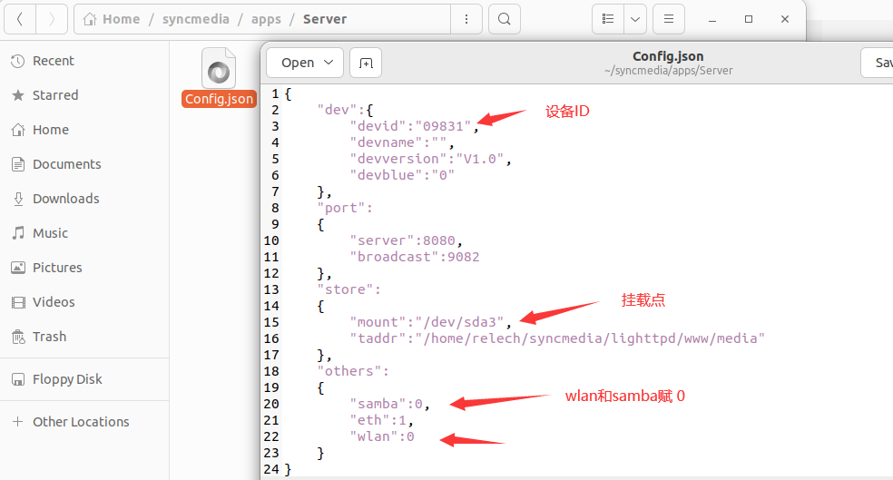

# 1.安装必要工具

```shell
sudo apt-get install git
sudo apt install make
sudo apt-get install gcc
sudo apt-get install cmake
sudo apt-get install g++
sudo apt-get install yasm 
```

# 2.拉代码

```shell
#gitee
git clone git@gitee.com:relech/mediasync.git
#github
git clone git@github.com:yubaihe/mediasync.git
```

# 3.编译

```
cd mediasync
source ./initenv.sh LINUX /home/relech/syncmedia/
make
```

# 4.修改配置项



# 5.运行

```shell
#设置环境变量
#需要以root权限运行
export ROOTDIR=/home/relech/syncmedia/
#启动
$ROOTDIR/start.sh
#停止
$ROOTDIR/stop.sh
```

# 6.使用介绍

> http://www.yubaihe.net/privacy/myg/help.html

# 7.发行

> Windows版本需要将第一部分和第二部分全部下载以后再解压

[Windows(第一部分)](./Release/MediaSyncSetup.zip.001 "点击下载windows安装程序第一部分")

[Windows(第二部分)](./Release/MediaSyncSetup.zip.002 "点击下载windows安装程序第二部分")

> Android

[Android](./Release/MediaSync.apk "点击下载Android安装程序")

> IOS


> MAC

[MAC](https://apps.apple.com/cn/app/%E7%BE%8E%E4%BA%BF%E6%A0%BC/id6444566528)